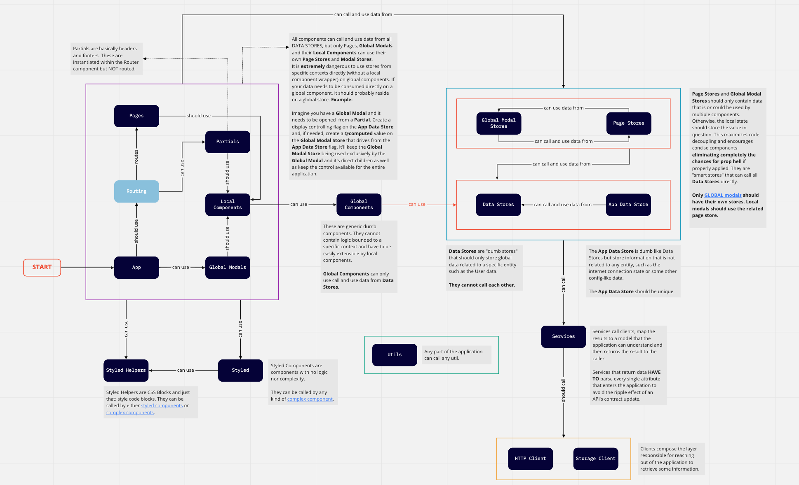

# React - Template Arquitetural

Inicializado com [Create React App](https://github.com/facebook/create-react-app).

## Descrição
Esse projeto foi desenvolvido baseado na [mac React Template]() e é responsável pela viabilização do credenciamento de estabelecimentos comerciais por parte do próprio cliente. 

## Atenção
Para garantir uma boa evolução da aplicação é importantíssimo que todos os engenheiros entendam os conceitos presentes na nossa [documentação](https://projetoblue1.atlassian.net/l/c/1ShCmJfm). Nela você encontra a visão global, todo o data flow (importantíssimo), informações sobre os blocos arquiteturais e suas subcategorias. Para acessá-la basta clicar [aqui](https://projetoblue1.atlassian.net/l/c/1ShCmJfm).

## Overview Arquitetural

Esse diagrama está presente na documentação e foi colocado aqui com o intuito de facilitar a consulta após sua leitura. Lembre-se: ele **NÃO SUBSTITUI** o conteúdo da [documentação](https://projetoblue1.atlassian.net/l/c/1ShCmJfm).

## Como Rodar o Projeto
Sem mistérios por aqui: `yarn install && yarn start`

Acessa lá e ajude os nossos times a ficarem mais fortes! :punch:

## Links Úteis
- [Documentação da template](https://projetoblue1.atlassian.net/l/c/1ShCmJfm)
- [React documentation](https://reactjs.org/)
- [Create React App documentation](https://facebook.github.io/create-react-app/docs/getting-started)
- [Figma](https://www.figma.com/file/Hsk86w2uoRsftNkCIINdcz/%5BEC%5D-Draft?node-id=3%3A2)
