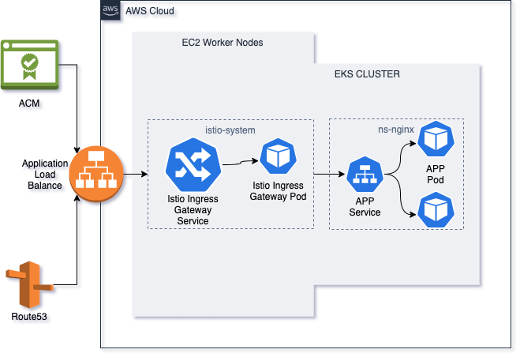

# eks-bootstraper

## Sobre
Este manual tem como objetivo instruir qualquer pessoa a criar um cluster no Kubernetes utilizando a AWS, num ambiente misto de EC2, EKS e ELB. Os componentes utilizados são:

 - EKS: para gerenciamento do ControlPlane do Kubernetes
 - EC2: para criação de nodes
 - ELB: para fazer a exposição dos serviços para a Internet/VPN

## Pré requisitos:
Criar uma conta no IAM com o nome **eks-cluster-account** utilizando as policies abaixo:

- AmazonEKSClusterPolicy
- AmazonEKSWorkerNodePolicy
- AmazonEC2ContainerRegistryFullAccess
- AmazonEKSServicePolicy
- AmazonECSTaskExecutionRolePolicy
- AmazonEKS_CNI_Policy
- AmazonEKSFargatePodExecutionRolePolicy
- AmazonEKSVPCResourceController
- AdministratorAccess **(deverá ser retirada após da criação do cluster)**

## Setup da instância bastion
Para que o acesso ao cluster fique seguro, é recomendado usar uma instância **bastion** na AWS e, para tal, siga o passos:

-  Logar com a conta **eks-cluster-account** no painel.
-  Criar uma instancia EC2 com o Amazon linux 2 do tipo t3a.nano
-  Instalar o awscli com o python-pip
    - ```sudo yum install python37 && curl -O https://bootstrap.pypa.io/get-pip.py && python3 get-pip.py --user```

    - ```pip3 install --upgrade --user awscli```
-  Rodar o comando **aws configure** e colocar o AK e SK da conta criada anteriormente
-  Instalar o kubectl:
    - ```curl -o kubectl https://amazon-eks.s3.us-west-2.amazonaws.com/1.20.4/2021-04-12/bin/linux/amd64/kubectl && chmod 755```
    
    - ```kubectl && mv kubectl /usr/local/bin```
-  Instalar o eksctl:
    - ```curl --silent --location "https://github.com/weaveworks/eksctl/releases/latest/download/eksctl_$(uname -s)_amd64.tar.gz" | tar xz -C /tmp && chmod 755 /tmp/eksctl && sudo mv /tmp/eksctl /usr/local/bin```
- Configurar as seguintes variáveis para facilitar a criação dos recrusos:
    - ```export NOME_CLUSTER='colocar o nome do cluster aqui'```
    
    - ```export ID_CONTA=$(aws sts get-caller-identity --output text --query 'Account')```
    
    - ```export REGIAO='colocar a região desejada'```

## Criação do cluster

- Criar um novo cluster no menu EKS
    - Nome: <NOME DO CLUSTER>
    - Versão: 1.21
    - Criar uma role e adicionar para o EKS
        - ```aws iam create-role --role-name EKSClusterRole --assume-role-policy-document file://aws/trust-eks-policy.json```
        
        - ```aws iam attach-role-policy --policy-arn arn:aws:iam::aws:policy/AmazonEKSClusterPolicy --role-name EKSClusterRole```
    - Acesso: privado
    - Add-ons: todos e com a versão mais atual
- Escolher um security group para comunicação entre os nós e subnets **(você pode criar um para deixar segregado)**.
- Adicionar grupo de nós
    - Nome: eks-nodegroup-<NOME DO CLUSTER>-01
    - Criar uma role e adicionar para o Node Group:
        - ``aws iam create-role --role-name EKSClusterNodeGroups --assume-role-policy-document file://aws/trust-ec2-policy.json``

        - ``aws iam attach-role-policy --policy-arn arn:aws:iam::aws:policy/AmazonEKSWorkerNodePolicy --role-name EKSClusterNodeGroups``
        
        - ``aws iam attach-role-policy --policy-arn arn:aws:iam::aws:policy/AmazonEC2ContainerRegistryReadOnly --role-name EKSClusterNodeGroups``
        
        - ``aws iam attach-role-policy --policy-arn arn:aws:iam::aws:policy/AmazonEKS_CNI_Policy --role-name EKSClusterNodeGroups``
        
        - ```aws iam attach-role-policy --policy-arn arn:aws:iam::aws:policy/EC2InstanceProfileForImageBuilderECRContainerBuilds --role-name EKSClusterNodeGroups```

Definir a instância com a classe t3a **(o tipo vai depender da demanda e do tipo de ambiente)**, usar o Amazon Linux  2, com Spot e 150 GB de disco, para configurar o **Node Group scaling configuration** é preciso levar em consideração o tipo do cluster (produtivo ou qa) e também o que vai rodar nele. Feito isso, escolha as subnets e crie o grupo de nodes. Agora faça login na instância criada anteriormente e crie o arquivo de configuração com o seguinte comando:

- ```ews eks update-kubeconfig --region ${REGIAO} --name ${NOME_CLUSTER}```

Após isso, verifique se o cluster está ok e os nodes criados com:

- ```kubectl get nodes```

## Setup do ALB
Essa configuração de cluster precisa de um ingress controller específico para a AWS, sendo assim, iremos utilizar um modelo INTERNET <ALB> WORKERS para que fique dinâmico o auto-saling e a gestão seja mais fácil. Primeiramente é preciso criar uma policy e adicioná-la as roles que criamos anteriormente.

- ``curl -o aws/iam-policy.json
  https://raw.githubusercontent.com/kubernetes-sigs/aws-load-balancer-controller/v2.2.0/docs/install/iam_policy.json``

- ``aws iam create-policy
    --policy-name AWSLoadBalancerControllerIAMPolicy220
    --policy-document file://aws/iam-policy.json``

- ``aws iam attach-role-policy --role-name EKSClusterNodeGroups
  --policy-arn="arn:aws:iam::${ID_CONTA}:policy/AWSLoadBalancerControllerIAMPolicy220"``

- ``aws iam attach-role-policy --role-name EKSClusterNodeGroups
  --policy-arn arn:aws:iam::aws:policy/AmazonEKSWorkerNodePolicy``

- ``aws iam attach-role-policy --role-name EKSClusterNodeGroups
  --policy-arn arn:aws:iam::aws:policy/AmazonEKS_CNI_Policy``

- ``aws iam attach-role-policy --role-name EKSClusterNodeGroups
  --policy-arn arn:aws:iam::aws:policy/AWSLoadBalancerControllerIAMPolicy220``

Agora é preciso criar um IAM OIDC para que o cluster consiga utilizar a roles criadas acima. Então rode os comandos para fazer a associação enter o cluster e o IAM OIDC e depois crie uma IAM ServiceAccount para o cluster.

- ``eksctl utils associate-iam-oidc-provider --region ${REGIAO} --cluster ${NOME_CLUSTER} --approve``

- ``eksctl create iamserviceaccount --cluster=${NOME_CLUSTER} --namespace=kube-system --name=aws-load-balancer-controller --attach-policy-arn=arn:aws:iam::${ID_CONTA}:policy/AWSLoadBalancerControllerIAMPolicy220 --override-existing-serviceaccounts --approve``

## ALB Ingress controller

Criadas todas regras para que o cluster possa funcionar e criar serviços na AWS, agora é hora de criar o Ingress Controller com um Application Load Balancer. Comece executando o comando de criação do cert-manager:

- ```kubectl apply -f https://github.com/jetstack/cert-manager/releases/download/v1.3.1/cert-manager.yaml```

Antes de criar os recursos do Ingress, é preciso editar o arquivo **aws/aws-load-balancer-controller-v220-all.yaml** para que quando ele for criado, saiba qual o nome do cluster:

- ```vim +778 aws/aws-load-balancer-controller-v220-all.yaml```

Para sair use ```:x!``` e rode o comando para criar o ingress:

- ```kubectl apply -f aws/aws-load-balancer-controller-v220-all.yaml```

## Istio

Nessa configuração utilizamos como service mesh o Istio, ele irá nos auxiliar em diversos tipos de configuração (se quiser ler mais sobre o Istio, acesse [aqui](https://istio.io/latest/about/service-mesh/)). Por padrão o Istio funciona com um ELB do tipo clássico (CLB), mas além de ser um modelo muito antigo, ele está entrando em desuso, sendo assim, iremos utilizá-lo com o Application Load Balance (ALB). Ele funciona da seguinte forma:




### Instalação e Configuração

Para instalar, execute o comando:

- ```istioctl install --set profile=default --set values.gateways.istio-ingressgateway.type=NodePort -y```

Nesse comando estamos instalando o profile padrão com o gateway usando NodePort. Após o término da instalação, está na hora de configurar o deployment do Ingress, mas antes vamos editar o IstioIngressGateway, que é o **service** responsável por criar a ligação entre os nodes e o gateway interno. Para isso, precisamos definir no service qual a porta e qual o endpoint de healthcheck o ALB vai fazer nos nodes, então rode o seguinte comando:

- ```kubectl -n istio-system get svc istio-ingressgateway -o jsonpath='{.spec.ports[?(@.name=="status-port")].nodePort}'```

Agora com o número da porta, edite o arquivo do service:

- ```kubectl -n istio-system edit svc istio-ingressgateway```

No arquivo, vá em **annotations** e coloque as seguintes linhas:


```yaml
    alb.ingress.kubernetes.io/healthcheck-path: /healthz/ready
    alb.ingress.kubernetes.io/healthcheck-port: "<PORTA OBTIDA ANTERIORMENTE>"
```

Saia o arquivo com ```:x!```. Agora precisamos editar o arquivo do Ingress.

- ```vim istio/ingress-alb.yaml```

No arquivo, substitua os valores com os da sua instalação. E crie o Ingress:

- ```kubectl apply -f istio/ingress-alb.yaml```

Após executar esse comando, você deve ter percebido que foi criado um ALB (Aplication Load Balance) e um TG (Target Group)  na mesma região do cluster. Aqui é importante colocar uma regra de firewall para as portas 80 (HTTP) e 443 (HTTPS). A partir desse ponto, o Istio irá se responsabilizar por incluir no TG novas instâncias que forem registradas no cluster, seja via auto-scaling, seja por inclusão de um node group novo.

Agora é preciso criar o gateway, que é responsável por fazer a conexão entre o Ingress e os virtual services. Para isso, use o seguinte comando:

- ```kubectl apply -f istio/istio-gateway.yaml```

Também é preciso tirar o "server-name" dos cabeçalhos HTTP, isso não é uma configuração funcional, serve somente para ocultar algumas informações sensíveis. 

- ```kubectl apply -f istio/rm-envoy-header.yaml```


### Istio addons

O Istio possui uma série de addons para facilitar a administração dos serviços e deployments, os principais são:

 - [Kiali](https://kiali.io/): ferramenta de configuração e manutenção dos Deployments do cluster que usam o Istio, ele é muito útil para ver se existem problemas nas configurações de serviços ou na parte de monitoria/troubleshooting das aplicações (Deployments). Para instalá-lo, use o comando (por conta de um problema dos CRDs, rode ele 2x):
 
    - ```kubectl apply -f https://raw.githubusercontent.com/istio/istio/release-1.10/samples/addons/kiali.yaml```

 - [Prometheus](https://prometheus.io/): ferramenta de monitoria, ele vai nos ajudar a coletar métricas dos PODs. Essas métricas podem ser usadas tanto no Kiali, quanto no Grafana. Para instalá-lo, use o comando:
 
    - ```kubectl apply -f https://raw.githubusercontent.com/istio/istio/release-1.10/samples/addons/prometheus.yaml```
    
 - [Jaeger](https://www.jaegertracing.io/): Uma ferramenta complementar ao Kiali que diponibiliza métricas de rede/requisição dentro dos dashboards do Kiali. Para instalá-lo, use o comando:
 
    - ```kubectl apply -f https://raw.githubusercontent.com/istio/istio/release-1.10/samples/addons/jaeger.yaml```


## Setup do ambiente

Agora vamos subir uma aplicação teste para validar todas as configurações feitas. Primeiramente crie um **namespace**:

- ```kubectl apply -f app/ns-nginx.yaml```

E também adicione a label do Istio para que ele crie os sidecars necessários:

- ```kubectl label namespace ns-nginx istio-injection=enabled```

Esse comando faz com que todo POD no namespace seja criado com 2 sidecards, o istio-proxy e o istio-init. Agora, caso seja necessário, crie os Secrets e os configMaps.

- ```kubectl apply -f app/nginx-config-map.yaml```

- ```kubectl apply -f app/nginx-secret.yaml```

Caso sua aplicação use uma imagem privada, é preciso criar antes o secret do registry onde ela está armazenada, para isso existem algumas opções, a utilizada aqui é através de um arquivo **config.json**. Esse arquivo é gerado quando o comando **get-ecr-login** é executado. 

- ```kubectl create secret generic regcred --from-file=.dockerconfigjson=./config.json --type=kubernetes.io/dockerconfigjson -n ns-nginx```

Para subir a aplicação, execute o comando:

- ```kubectl apply -f app/nginx-deployment.yaml```

Após rodar o apply do Deployment, agora é preciso liberar a aplicação para que ela seja acessada tanto dentro do cluster, quanto fora dele (caso seja necessário). Para isso, execute os comandos:

- ```kubectl apply -f app/nginx-services.yaml```  - service: expõe a aplicação para o cluster

- ```kubectl apply -f app/nginx-virtualservice.yaml``` - virtualService: expõe a aplicação para o istio-gateway

- ```kubectl apply -f app/nginx-destinationrules.yaml``` - destinationRules: faz o balanceamento de versões do Deployment


Agora é preciso validar se está tudo ok, para tal, use o curl:

- ```curl -vvv https://<ENDEREÇO EXTERNO>/```

## Utilidades

Shell para poder validar conexões dentro do cluser entre os serviços:

- ```kubectl run my-shell -n <NAMESPACE> --rm -i --tty --image ubuntu -- bash```
Irá abrir um shell usando ubuntu, a máquina é apagada quando faz logout.

Utilizar os recursos do Istio sem precisar expor via ingress:

- ```kubectl -n istio-system port-forward services/kiali 8080:20001``` 
Para o serviço do Kiali, por exemplo. Depois é só abrir no browser http://localhost:8080.

Geralmente, quando se faz uma requisição para um serviço usando Istio, o tipo do servidor fica exposto no header de resposta, para que isso não aconteça, é preciso adicionar um EnvoyFilter removendo o server_name. 

- ```kubectl apply -f app/rm-envoy-header.yaml```

## BackLog

 - Colocar um desenho do projeto no **Sobre**
 - Fazer a criação do cluster usando Iac (Terraform ou CloudFormation)
 - Configurar o balanceamento de versões para um deployment (Canary Deploy)
 - Criar uma seção para o deployment com PV e PVC

## Referências
 - https://docs.aws.amazon.com/eks/latest/userguide/aws-load-balancer-controller.html
 - https://kubernetes-sigs.github.io/aws-load-balancer-controller/v2.2/deploy/installation/
 - https://istio.io/latest/docs/setup/getting-started/

[]

Os passos-time são os seguintes:

Criação da VPC e parte de rede - Infra
Criação do cluster - Infra
Criação dos recursos (namespaces, configmaps, secrets)* - SRE
Adaptação dos deployments (arquivos de manifesto do Kubernetes) e das pipelines - SRE Deployers
 

Os arquivos de manifesto são os seguintes:

secret.yaml – para os dados sensíveis (conexões com banco de dados, tokens, AKSK, usuários/senha. Lembrem-se que esse é um por projeto/aplicação);
config-map.yaml – para dados compartilhados entre os pods (geralmente configurações do Confluent Cloud, usem o bom senso);
deployment.yaml – arquivo que contém todos os recursos para a aplicação ficar disponível.
 

pegar os dados brutos do Rancher e distribuir nesses 3 arquivos. 
* os config-maps e secrets podem ser criados durante a criação do deployment.


Enjoy yourself, it's la8er than u think.
